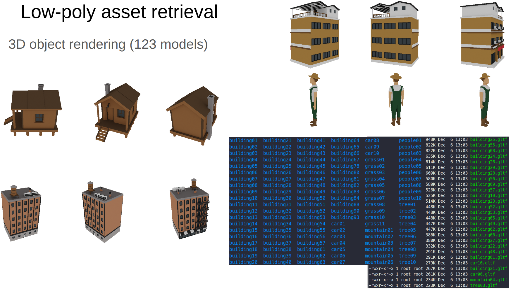
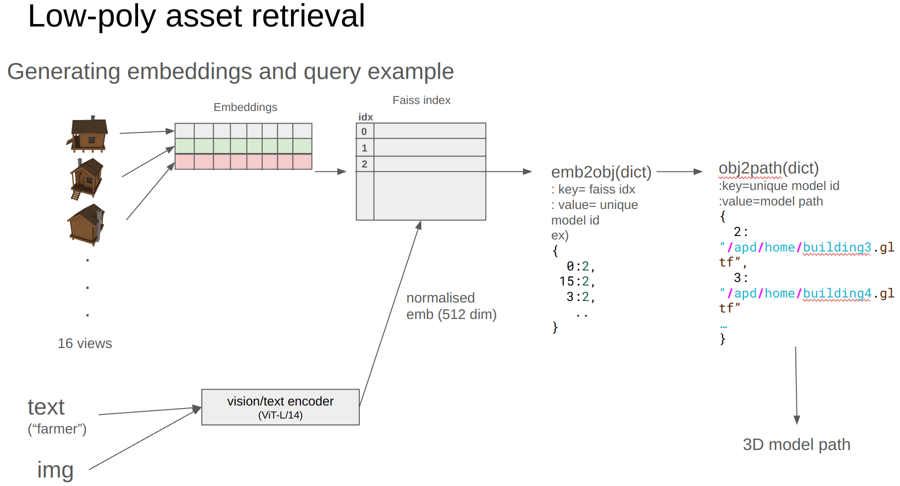
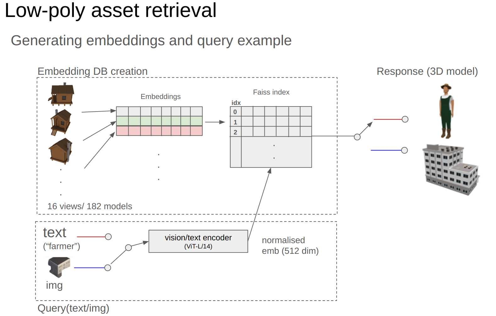
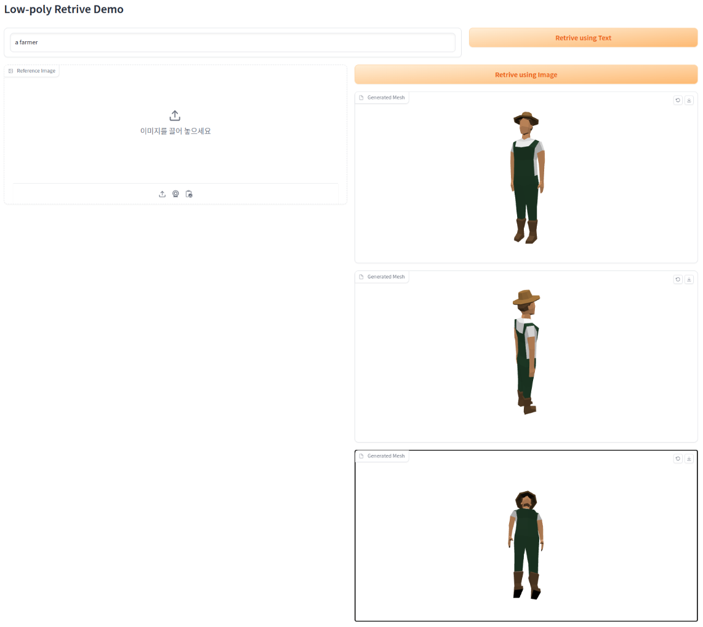
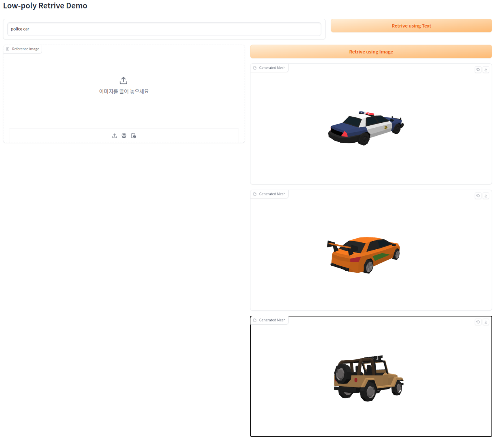
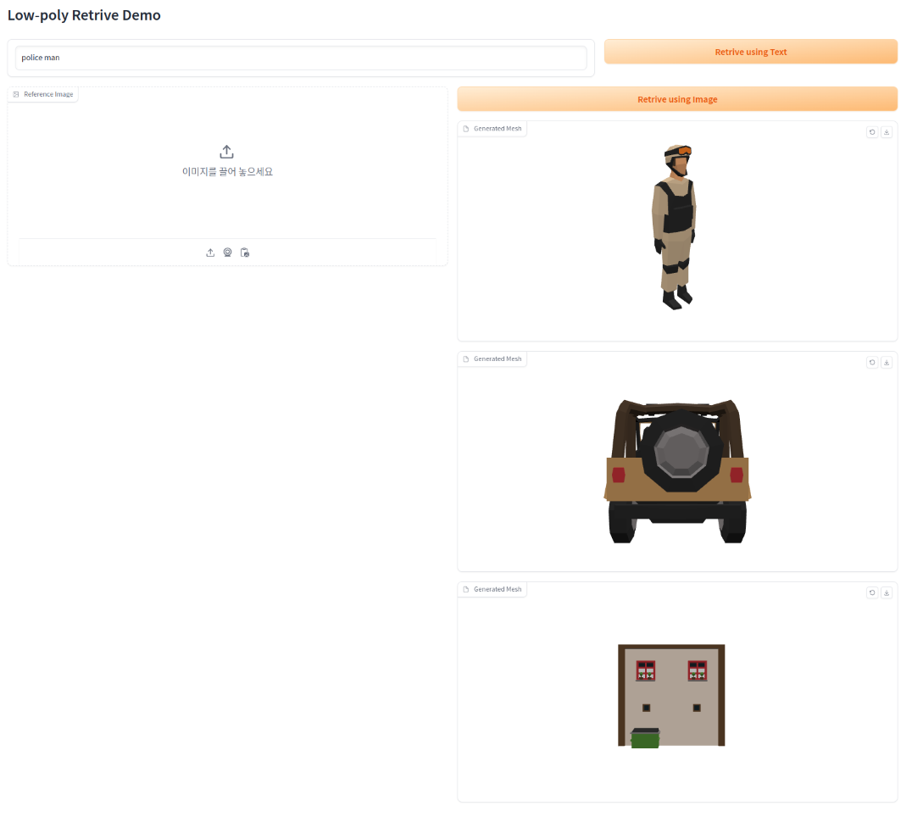
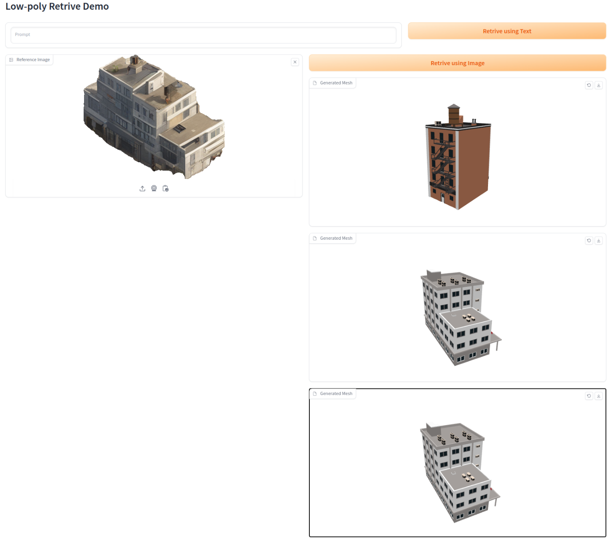
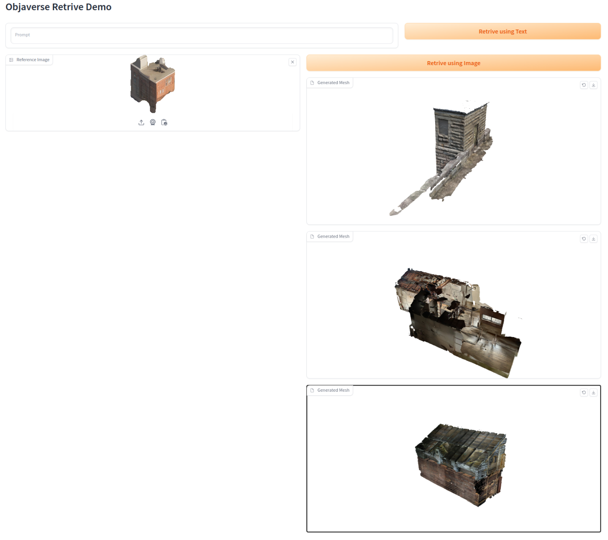

# Faiss toy example and profiling

This repo contains 3D model retreival either from text or image

 


 


## Software version
| Package | Version      | Description            |
|---------|--------------|------------------------|
| python  | 3.8.13      |        |
| faiss   | 1.7.2   |  |
| torch   | 1.13.0+cu117   |   |
| torchvision   | 0.14.0   |   |
| gradio   | 4.4.1  |   |
| diffusers | 0.23.1 |    |
| CUDNN | 8500| |
| CUDA version| 11.7| |
- Note that faiss-gpu is sensitive to dependencies' version. If you encounter getting stuck or stalling more than a minute while operating faiss-gpu, please make sure package versions.

You may want to run the following command for the dependencies (recommended to use any virtual evn or conda or docker..)
```bash
pip install torch==1.13.0 torchvision==0.14.0 rembg faiss-gpu==1.7.2 diffusers==0.23.1 gradio==4.4.1 opencv-python openai-clip
```

## Dataset download


We used free-lowpoly assets that can be downloaded from [Unity store](https://assetstore.unity.com/popular-assets--low-poly) for simplity but one can use a larger scale 3D dataset (e.g., [Objaverse XL](https://objaverse.allenai.org/))

# Objaverse Retrival
## Overall pipeline



### Text-based retrieval experimental results
The top row indicates the most probable retrieval results (k = 3).



There are some false positive at lower-ranking retrievals.

### Image-based retrieval experimental results



# Step-by-step guide
## 1. Generate asset foler name json
```bash
python CLIP_img_gen/gen_json.py --folder_path /home/inkyu/workspace/objaverse-rendering-private/rendered/gltf_all --output_file /home/inkyu/workspace/objaverse-rendering-private/rendered/rendering_folder_names_gltf_all.json
```

## 1. Calculate CLIP image embeddings by running

```bash
python CLIP_img_gen/calc_clip_img_embedding.py --data_root=/home/inkyu/workspace/objaverse-rendering-private/rendered/gltf_all --input /home/inkyu/workspace/objaverse-rendering-private/rendered/rendering_folder_names_gltf_all.json --outdir /home/inkyu/workspace/3D_object_retrieval/gltf_all_embs
```

## 2. Prepare the packed embedding in one single file

```bash
python CLIP_img_gen/prepare_embeddings.py --data_path /home/inkyu/workspace/3D_object_retrieval/gltf_all_embs --emb_name gltf_all
```
This will generate three files named `gltf_all_keys.pkl`, `gltf_all.pt`, `emb_idx2_gltf_all.pkl` under `emb` folder.

## 3. Generate faiss gpu index

```bash
python CLIP_img_gen/gen_faiss_index_gpu.py --emb_path /home/inkyu/workspace/3D_object_retrieval/emb/gltf_all.pt --faiss_output_name /home/inkyu/workspace/3D_object_retrieval/emb/faiss_idx_gltf_all.npy
```

## 4. Test retrive from objaverse
update 
```python
FAISS_GPU_IDX_PATH = "emb/faiss_idx_gltf_all.npy"
OBJ_PATH = 'emb/gltf_all_keys.pkl'
EMB_2_OBJ = 'emb/emb_idx_2_gltf_all.pkl'
```

```bash
python CLIP_img_gen/retrieval.py
```

```bash
index.is_trained = True
index.ntotal = 3014
finished loading CLIP
Input prompt is red car
car02.gltf
car09.gltf
```

## 5. Deploy the webui

Update `OBJAVERSE_PATH` in `gradio_app.py` and run
```bash
python webui/gradio_app.py
```


